# 12 - Deployment to Vercel with Testing

## 🎯 Tujuan Pembelajaran

Setelah mempelajari modul ini, Anda akan mampu:

- Deploy Next.js app ke Vercel
- Setup automatic deployments
- Run tests before deployment
- Configure preview deployments
- Monitor production errors

## 🚀 Kenapa Vercel?

**Analogi Kehidupan Nyata:**

Vercel untuk Next.js seperti:

- ⚡ **Go-Jek untuk jemput** - Optimized khusus untuk Next.js
- 🌍 **CDN global** - App mu cepat di seluruh dunia
- 🔄 **Auto-deploy** - Push code = auto live
- 👀 **Preview URLs** - Setiap PR dapat URL untuk review

## 📋 Pre-deployment Checklist

### 1. Environment Variables

```bash
# .env.local (local development)
NEXT_PUBLIC_API_URL=http://localhost:3000/api
DATABASE_URL=postgresql://localhost:5432/mydb
SECRET_KEY=local-secret-key

# .env.production (for production)
NEXT_PUBLIC_API_URL=https://api.myapp.com
DATABASE_URL=postgresql://prod-server/mydb
SECRET_KEY=super-secret-production-key
```

**Important:** Never commit `.env` files to git!

```bash
# .gitignore
.env
.env.local
.env.production
.env*.local
```

### 2. Build Test Locally

```bash
# Test production build
npm run build

# Test production server
npm run start
```

### 3. Run All Tests

```bash
# Run full test suite
npm run test

# Run with coverage
npm run test:coverage

# Make sure all pass! ✅
```

## 🛠️ Vercel Setup - Step by Step

### Method 1: Using Vercel CLI

```bash
# Install Vercel CLI
npm i -g vercel

# Login to Vercel
vercel login

# Deploy (from project root)
vercel

# Follow prompts:
# - Set up and deploy? Yes
# - Which scope? (your account)
# - Link to existing project? No
# - Project name? my-next-app
# - In which directory is your code? ./
# - Auto-detected Project Settings (Next.js)
# - Override settings? No

# Deploy to production
vercel --prod
```

### Method 2: Using Vercel Dashboard (Recommended)

1. **Go to vercel.com**
   - Login dengan GitHub account

2. **Import Project**
   - Click "Add New..." → "Project"
   - Select your GitHub repository
   - Click "Import"

3. **Configure Project**
   ```
   Framework Preset: Next.js
   Root Directory: ./
   Build Command: npm run build
   Output Directory: .next
   Install Command: npm install
   ```

4. **Add Environment Variables**
   - Click "Environment Variables"
   - Add production variables
   - Click "Deploy"

5. **Wait for Deployment** ⏳
   - Usually takes 1-3 minutes
   - You'll get a URL like: `my-app.vercel.app`

## 🔄 Automatic Deployments

### Production Deployments

```yaml
# Vercel automatically deploys:
# - Every push to main/master branch
# - Creates production deployment
# - Updates your domain
```

**How it works:**

1. Push code to `main` branch
2. Vercel detects push via webhook
3. Runs build command
4. Deploys to production
5. Updates live site

### Preview Deployments

```yaml
# Vercel creates preview URLs for:
# - Every pull request
# - Every push to non-main branches
# - Each commit gets unique URL
```

**Example workflow:**

```bash
# Create feature branch
git checkout -b feature/new-button

# Make changes and push
git add .
git commit -m "Add new button"
git push origin feature/new-button

# Vercel creates preview URL:
# https://my-app-git-feature-new-button-username.vercel.app
```

## 🧪 Running Tests Before Deploy

### Option 1: Vercel Ignored Build Step

```javascript
// vercel.json
{
  "ignoreCommand": "npm run test"
}
```

**Problem:** Tests run DURING build, slowing deployment.

### Option 2: GitHub Actions (Recommended)

```yaml
# .github/workflows/deploy.yml
name: Deploy to Vercel

on:
  push:
    branches: [main]
  pull_request:
    branches: [main]

jobs:
  test:
    runs-on: ubuntu-latest
    steps:
      - uses: actions/checkout@v3
      
      - name: Setup Node
        uses: actions/setup-node@v3
        with:
          node-version: '18'
          cache: 'npm'
      
      - name: Install dependencies
        run: npm ci
      
      - name: Run tests
        run: npm run test:ci
      
      - name: Build check
        run: npm run build

  deploy:
    needs: test  # Only deploy if tests pass
    runs-on: ubuntu-latest
    if: github.ref == 'refs/heads/main'
    
    steps:
      - uses: actions/checkout@v3
      
      - name: Deploy to Vercel
        uses: amondnet/vercel-action@v20
        with:
          vercel-token: ${{ secrets.VERCEL_TOKEN }}
          vercel-org-id: ${{ secrets.VERCEL_ORG_ID }}
          vercel-project-id: ${{ secrets.VERCEL_PROJECT_ID }}
          vercel-args: '--prod'
```

### Getting Vercel Tokens

```bash
# 1. Get Vercel Token
# - Go to vercel.com/account/tokens
# - Create new token
# - Copy token

# 2. Get Project IDs
vercel link

# This creates .vercel/project.json:
{
  "orgId": "team_xxxxx",
  "projectId": "prj_xxxxx"
}

# 3. Add to GitHub Secrets
# - Go to repo Settings → Secrets → Actions
# - Add:
#   - VERCEL_TOKEN
#   - VERCEL_ORG_ID
#   - VERCEL_PROJECT_ID
```

## 🎯 Deployment Workflow Example

### Complete Flow

```mermaid
graph TD
    A[Developer writes code] --> B[Run tests locally]
    B --> C[Commit & Push to feature branch]
    C --> D[GitHub Actions: Run tests]
    D --> E{Tests Pass?}
    E -->|No| F[Fix code]
    F --> B
    E -->|Yes| G[Vercel: Create preview deployment]
    G --> H[Review on preview URL]
    H --> I[Create Pull Request]
    I --> J[Code review]
    J --> K{Approved?}
    K -->|No| F
    K -->|Yes| L[Merge to main]
    L --> M[GitHub Actions: Run tests again]
    M --> N{Tests Pass?}
    N -->|No| O[Rollback]
    N -->|Yes| P[Vercel: Deploy to production]
    P --> Q[Live! 🎉]
```



### Real Example

```bash
# Day 1: Start feature
git checkout -b feature/user-profile
# ... code changes ...
npm test  # ✅ All pass
git commit -m "Add user profile page"
git push origin feature/user-profile

# → Vercel creates: https://myapp-git-feature-user-profile.vercel.app
# → GitHub Actions run tests
# → All green ✅

# Day 2: Create PR
# → Open PR on GitHub
# → Team reviews preview URL
# → Request changes

# Day 3: Update based on feedback
# ... fix issues ...
npm test  # ✅ All pass
git commit -m "Fix profile layout"
git push

# → Vercel updates preview URL
# → New commit tested by GitHub Actions

# Day 4: Merge
# → PR approved and merged to main
# → GitHub Actions run full test suite
# → Tests pass ✅
# → Vercel deploys to production
# → Live at https://myapp.vercel.app 🚀
```

## 📊 Monitoring Production

### Vercel Analytics

```typescript
// Enable in vercel.json
{
  "analytics": {
    "enabled": true
  }
}
```

**What you get:**

- Page views
- Unique visitors
- Top pages
- Performance metrics

### Error Monitoring with Sentry

```bash
# Install Sentry
npm install --save @sentry/nextjs

# Initialize
npx @sentry/wizard -i nextjs
```

```typescript
// sentry.client.config.js
import * as Sentry from '@sentry/nextjs'

Sentry.init({
  dsn: process.env.NEXT_PUBLIC_SENTRY_DSN,
  environment: process.env.NODE_ENV,
  tracesSampleRate: 1.0,
})
```

```typescript
// pages/_error.tsx
import * as Sentry from '@sentry/nextjs'
import type { NextPage } from 'next'
import type { ErrorProps } from 'next/error'

const CustomErrorPage: NextPage<ErrorProps> = ({ statusCode }) => {
  return (
    <div>
      <h1>{statusCode} Error</h1>
      <p>Something went wrong</p>
    </div>
  )
}

CustomErrorPage.getInitialProps = async (contextData) => {
  await Sentry.captureUnderscoreErrorException(contextData)
  
  return Error.getInitialProps(contextData)
}

export default CustomErrorPage
```

## 🔒 Security Best Practices

### 1. Environment Variables

```typescript
// ✅ GOOD: Public variables (client-safe)
NEXT_PUBLIC_API_URL=https://api.myapp.com
NEXT_PUBLIC_ANALYTICS_ID=UA-12345-1

// ❌ BAD: Secrets in public variables
NEXT_PUBLIC_DATABASE_PASSWORD=secret123  // NO!
NEXT_PUBLIC_API_KEY=sk_live_abc123       // NO!

// ✅ GOOD: Server-only secrets
DATABASE_URL=postgresql://...
API_SECRET_KEY=sk_live_abc123
```

### 2. Content Security Policy

```typescript
// next.config.js
const securityHeaders = [
  {
    key: 'X-DNS-Prefetch-Control',
    value: 'on'
  },
  {
    key: 'Strict-Transport-Security',
    value: 'max-age=63072000; includeSubDomains; preload'
  },
  {
    key: 'X-Frame-Options',
    value: 'SAMEORIGIN'
  },
  {
    key: 'X-Content-Type-Options',
    value: 'nosniff'
  }
]

module.exports = {
  async headers() {
    return [
      {
        source: '/:path*',
        headers: securityHeaders,
      },
    ]
  },
}
```

## 🎯 Practice Exercise

Deploy your todo app to Vercel:

1. ✅ Create Vercel account
2. ✅ Connect GitHub repository
3. ✅ Add environment variables
4. ✅ Deploy to production
5. ✅ Create feature branch
6. ✅ Make changes and push
7. ✅ Review preview URL
8. ✅ Setup GitHub Actions for tests
9. ✅ Add Vercel deploy action
10. ✅ Merge and watch auto-deploy

## 💡 Key Takeaways

1. ✅ **Test before deploy** - Use GitHub Actions
2. ✅ **Use preview URLs** - Review changes before production
3. ✅ **Automate everything** - Push to deploy
4. ✅ **Protect secrets** - Never commit env files
5. ✅ **Monitor production** - Use analytics and error tracking
6. ✅ **Security headers** - Add in next.config.js
7. ✅ **Rollback ready** - Vercel keeps deployment history

## 🚨 Troubleshooting Common Issues

### Build Fails

```bash
# Check build logs in Vercel dashboard
# Common issues:
# - Missing environment variables
# - TypeScript errors
# - Test failures
# - Missing dependencies

# Solution: Test build locally first
npm run build
```

### Environment Variables Not Working

```bash
# Make sure variables are added in Vercel dashboard
# For client-side: Must start with NEXT_PUBLIC_
# Rebuild after adding new variables
```

### Preview URL 404

```bash
# Vercel sometimes needs time to build
# Wait 2-3 minutes
# Check deployment logs
# Verify branch name is correct
```

---

**Congratulations!** 🎉 You've completed the Testing & Deployment module!

**Summary:**

- ✅ Testing fundamentals
- ✅ Jest & React Testing Library
- ✅ Testing components, forms, UI updates
- ✅ Mocking APIs
- ✅ Async testing
- ✅ Coverage reports
- ✅ CI/CD integration
- ✅ Deployment to Vercel

**Next Steps:**

- Practice building tested apps
- Maintain high coverage
- Setup CI/CD pipelines
- Monitor production

Happy coding! 🚀
